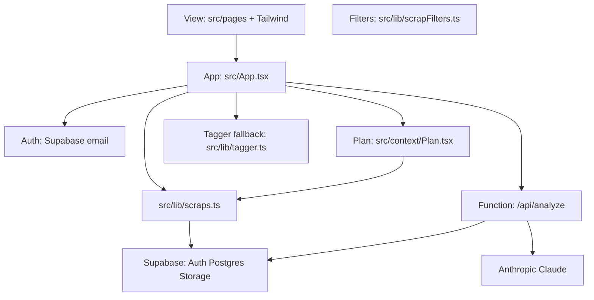

# Architecture

Verdict: the tree is a **Vite + React SPA** on Firebase Hosting, with a Cloud Function (and a Netlify Function twin) for Claude classify, and the official **Supabase** folder for Auth, Postgres, and Storage.

Related: [README.md](README.md) · [PRODUCT.md](PRODUCT.md) · [ROADMAP.md](ROADMAP.md) · [supabase/README.md](supabase/README.md) · `.cursor/rules/`

## Why this shape

The product is still a personal capture box. The client is now bundled so TypeScript, Tailwind, and serverless classify can ship together.

```
index.html              Vite shell
src/                    React views, i18n, lib
public/assets/          favicon, intro still
firebase.json           Hosting public=dist, SPA + /api/analyze rewrite
functions/              Cloud Function /api/analyze
netlify/functions/      Netlify twin of the same classify
netlify.toml            Netlify build + SPA fallback
supabase/               migrations, optional og-preview
```

## Layers



| Layer | Files | Role |
| --- | --- | --- |
| View | [`src/pages/`](src/pages/), [`src/components/`](src/components/), [`src/index.css`](src/index.css) | Intro, shelf, legal, DESIGN tokens |
| App | [`src/App.tsx`](src/App.tsx) | Routes, sheets, session gate |
| Prefs | [`src/context/Prefs.tsx`](src/context/Prefs.tsx) | Language, Look (fridge\|library), theme, palette on this device |
| Auth | [`src/context/Auth.tsx`](src/context/Auth.tsx), [`src/lib/supabase.ts`](src/lib/supabase.ts) | Email / password, Google, 둘러보기, find/reset email flows |
| Plan | [`src/context/Plan.tsx`](src/context/Plan.tsx), [`src/lib/plans.ts`](src/lib/plans.ts), [`src/lib/profiles.ts`](src/lib/profiles.ts) | Tier limits, trial, storage usage, ad flag, upload gates |
| Filters | [`src/lib/scrapFilters.ts`](src/lib/scrapFilters.ts) | Shared query/type/day filter and dashboard aggregates |
| Classify | [`functions/src/index.ts`](functions/src/index.ts), [`netlify/functions/analyze.ts`](netlify/functions/analyze.ts), [`src/lib/tagger.ts`](src/lib/tagger.ts) | Claude with JWT; MIME/URL fallback |
| Persist | [`src/lib/scraps.ts`](src/lib/scraps.ts) | `public.scraps` (incl. engagement + `og`) + `public.profiles` + `scrap-media/{userId}/{scrapId}/`. Shelf paints metadata first; image `media_path` values get batch `createSignedUrls` via `hydrateSignedMedia` (session-cached). |
| Guest store | [`src/lib/guest.ts`](src/lib/guest.ts), [`src/lib/localScraps.ts`](src/lib/localScraps.ts), [`src/lib/guestMigrate.ts`](src/lib/guestMigrate.ts) | 둘러보기 scraps in `localStorage` on this device, plus the move-to-account path |
| OG | [`src/lib/og.ts`](src/lib/og.ts), [`supabase/functions/og-preview`](supabase/functions/og-preview) | URL preview after classify; Detail lazy backfill |

## Data flow

1. **Entry.** Intro is public. **책장을 연다** opens email sign in / sign up. A session paints the shelf.
2. **Capture.** Paste/drop/`+`. Files upload first. `/api/analyze` gets the user JWT. Images may go to Claude vision. Failure uses the local tagger.
3. **Save.** Upsert the scrap row. List is newest first, RLS `auth.uid() = user_id`. `PlanProvider` sums stored-media bytes for quota; free trial ends at `profiles.trial_ends_at`.
4. **Filter.** Shelf holds query, type, and optional local day. `filterScraps` drives list, detail prev/next, and dashboard stats.
5. **Leave.** Sign out returns to intro. Account scraps are not kept in `localStorage`.

**둘러보기 branch.** The anonymous session still signs the classify JWT, but every scrap call in `src/lib/scraps.ts` routes to `localStorage` when `isBrowseUser(user)`. Media rides along as an inline data URL, so limits are per device: 1.5MB a file, about 4MB in total. Keys are `mybrary.guest.scraps` (not keyed by anonymous uid, so a fresh browse session on the same browser picks the shelf back up), `mybrary.guest.notice` (the one-time storage notice), and `mybrary.guest.migrateAsked`. Another browser or cleared history means the scraps are gone; signing into a real account offers to move whatever is still on the device.

`ANTHROPIC_API_KEY` is read in the function only (`process.env` on Firebase, `Netlify.env.get` on Netlify). Never in Vite.

## What this is not

- A second static `js/` client next to React.
- `service_role` in Vite.
- A recipe app. Claude classifies scraps, it does not invent meals.
