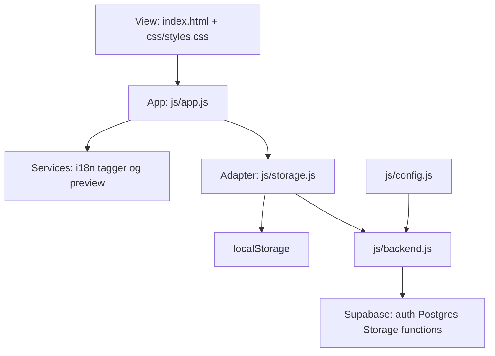

# Architecture

Verdict: the tree matches a typical **static web** layout (HTML / CSS / JS, no bundler) plus the official **Supabase** folder for optional backend. No folder move or framework rewrite is required.

Related: [README.md](README.md) · [PRODUCT.md](PRODUCT.md) · [ROADMAP.md](ROADMAP.md) · [supabase/README.md](supabase/README.md)

## Why this shape

The product constraint is a personal capture box that opens as files on disk or over `http://localhost`. There is no `package.json`, no `src/` vs `public/` split, and no React/Next app router. Those belong to a bundled SPA. This repo follows the classic site map instead:

```
index.html     entry markup (view)
css/           presentation
js/            behavior, split by layer
assets/        static files (favicon)
supabase/      schema, storage policies, Edge Functions
legal/         terms + privacy HTML
```

That is the same layout used by GitHub Pages sites, MDN-style demos, and other no-build clients. `supabase/` at the repo root is the documented Supabase CLI layout (`migrations/`, `functions/`).

## Layers



| Layer | Files | Role |
| --- | --- | --- |
| View | [`index.html`](index.html), [`css/styles.css`](css/styles.css), [`css/ai.css`](css/ai.css), [`assets/`](assets/), [`legal/`](legal/) | Markup, chrome, fridge-door CSS, policy pages. Semantic `header` / `main` / `footer`. |
| Config | [`js/config.js`](js/config.js) | Project URL, anon key, and `legal` operator strings. Empty or `YOUR_*` keeps the local path. Empty legal fields render 표시 예정. Never `service_role`. |
| App | [`js/app.js`](js/app.js) | Controller: events, draft, list, auth UI. Talks to storage and services only. |
| Services | [`js/i18n.js`](js/i18n.js), [`js/legal.js`](js/legal.js), [`js/tagger.js`](js/tagger.js), [`js/phish.js`](js/phish.js), [`js/og.js`](js/og.js), [`js/preview.js`](js/preview.js) | Copy, operator footer fill, classify, on-device URL-shape phishing check, Open Graph, media/document preview. |
| Persist adapter | [`js/storage.js`](js/storage.js) | The only persist API for the app. Lang/theme always local. Scraps local or remote. |
| Remote client | [`js/backend.js`](js/backend.js) | Supabase auth, upsert, signed URLs, migrate, realtime. Inactive until config is filled **and** a user is signed in. |
| Backend | [`supabase/`](supabase/) | `public.scraps` + RLS, private `scrap-media` bucket, `og-preview` function. |

Scripts are IIFE modules that hang a `Mybrary*` object on `window`. Load order in `index.html` is the dependency order: config → legal → supabase-js CDN → backend → i18n → storage → tagger → phish → og → preview → app.

## Data flow

1. **Entry.** Intro view (`#view-intro`, `data-surface="intro"`). Header 로그인 sheet holds Apple / Google / Browse. Empty config: demo session in `mybrary.session`. Filled config: OAuth or anonymous auth via `MybraryBackend`. A saved session still opens the app (`data-surface="app"`). Leave returns to intro.
2. **Capture.** Composer paste/drop/`+` menu. `MybraryTagger` sets type and tags. If the scrap is a web link, `MybraryPhish.assess` scores the URL shape in the draft (not persisted). A new capture replaces an open classify draft. Draft stays in memory until save.
3. **Preview.** Images/video/audio/docs through `MybraryPreview`. Links through `MybraryOg` (Edge Function when signed in, else public proxies).
4. **Save.** `MybraryStorage.saveScraps`. Local path: JSON in `mybrary.scraps` with a ~4.2MB budget. Remote path: row in `public.scraps`, bytes in `scrap-media/{userId}/{scrapId}/`.
5. **List.** Newest first in the client. Type, tag, search, and 일자별 (`createdAt` local day) filters are view-only. Remote tabs reload on visibility and on realtime.

Language, theme, and color palette stay on this device in both paths. The inline boot script in `index.html` reads `mybrary.theme` and `mybrary.palette` before CSS so the first paint does not flash. That is the one intentional bypass of `MybraryStorage`.

## What this is not

These would be the wrong target for this product:

- `src/` + bundler + `dist/` (the constraint is no build step).
- Next.js / Vite app-router folders (`app/`, `pages/`, `components/`).
- A second database such as IndexedDB alongside Supabase.
- Putting `service_role` or secrets in the client.

## Optional later (not required)

The layout already matches typical static-web architecture. These are hygiene items if the client grows, not a reason to restructure now:

- Split `js/app.js` (UI chrome vs draft vs list) if it keeps growing past a single controller.
- ES modules (`type="module"`) if `file://` is dropped as a first-class open path.
- A root `.gitignore` for editor junk and accidental filled keys (committed `js/config.js` must stay empty placeholders).

`data-surface` is `"intro"` | `"app"`. Header auth is a sheet, not a third surface. Policy pages stay static HTML in `legal/`. Operator identity strings are placeholders in `js/config.js` `legal`, never invented registrations.
