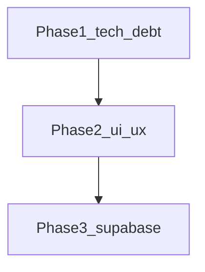

# myScrap roadmap

Personal capture box: paste or drop once, see type tags and a preview, find it again in a recency list. This file lists what ships today, what comes next, and in what order.

Related: [README.md](README.md) · [PRODUCT.md](PRODUCT.md) · [DESIGN.md](DESIGN.md) · [ARCHITECTURE.md](ARCHITECTURE.md)

**Order of work:** Phase 1 (tech debt), Phase 2 (UI/UX), and Phase 3 (Supabase wiring) are in this client. The app stays static HTML / CSS / JS with no build step. Folders follow a typical static site plus `supabase/` ([ARCHITECTURE.md](ARCHITECTURE.md)). API keys are not in the repo; fill [`js/config.js`](js/config.js) later. Empty or placeholder keys keep the on-device `localStorage` path.

---

## Shipped

Static client. With empty [`js/config.js`](js/config.js), Apple / Google / Browse stay on this device. With a real URL and anon key, those buttons talk to Supabase (OAuth or anonymous), and scraps sync per user.

### Capture and classify

- [x] Entry: Apple ID, Google, or Browse. Demo session in `localStorage` until keys are set. After keys, Apple/Google are OAuth and Browse is anonymous auth.
- [x] Composer: paste text or a URL, Enter to stick, drag-and-drop on the input.
- [x] `+` menu: clipboard, photo pick, file attach. Camera only on coarse pointers or viewports under 721px.
- [x] Classify-then-save draft: detected type, editable label, add/remove tags, memo, preview, save or cancel.
- [x] Link drafts show an on-device phishing-risk meter (URL shape only). Compact mark on saved link scraps.
- [x] Multi-file queue while a draft is open.
- [x] Sample scraps labeled Sample / 견본. Toggle to show or clear them.

### Type previews

- [x] Link: Open Graph via the `og-preview` Edge Function when signed in to Supabase, then microlink, then corsproxy / allorigins. Fallback is hostname and path.
- [x] Image: show the image. Compress long edge to 1600px before persist.
- [x] Video: poster frame; hover or tap to play. Honors `prefers-reduced-motion` for hover-play.
- [x] Audio: disc art; hover or tap to play.
- [x] Document: PDF first page via pdf.js (best over `http://localhost`). txt / md / csv excerpt. Office and HWP: extension tag and filename slip, not a page render.

### List and chrome

- [x] Recency list, newest first. Peel (delete) one item with a two-step confirm. Empty the door with a two-step confirm.
- [x] KO / EN in one layout. Light / system / dark. Magnet color: tangerine (default) or Jeju basalt. Follows the system until the user picks light or dark. Can return to system. Remembered on this device. Type / icon / control scale, white login, peach kitchen: [DESIGN.md](DESIGN.md).
- [x] Empty state ("항목이 없습니다." / English equivalent). Scroll-to-top FAB when not at the top.
- [x] Skip link, visible focus, `prefers-reduced-motion`.
- [x] Persist scraps in `localStorage` (~4.2MB budget) when keys are empty. Large files may stay session-only. Over quota, media data URLs are stripped. With keys and a signed-in user, scraps go to Postgres and media to a private Storage bucket.
- [x] Missing-media slip (filename, extension, size) instead of a broken preview.
- [x] Unsaved draft warning on Leave and Empty the door. Composer auto-grows. Edit a saved scrap.
- [x] Type chips, tag click-to-filter, light search. Image lightbox. Copy URL / save file when media is stored.
- [x] View motion: login ↔ app, draft, + menu, lightbox, clipping snap, FAB. Hover lift and press scale. Honors `prefers-reduced-motion`. See [DESIGN.md](DESIGN.md).

---

## Not shipped

### Intentionally out of this product

- Team / workspace language, Notion-style sidebar, folder tree.
- Live camera viewfinder (file `capture` input is enough).
- Server-side or paid AI tagging.
- Share, export, account settings screens.
- Bundler, test runner, or framework. Stay static HTML / CSS / JS.
- IndexedDB as a new client database. Frontend-external storage is Supabase (Phase 3, wired; keys filled later).
- Moving into `src/` / `public/` or an app-router tree. The current folders already match a typical static site ([ARCHITECTURE.md](ARCHITECTURE.md)).

### Operator follow-up (not code)

Create a Supabase project and paste the URL plus anon key into [`js/config.js`](js/config.js). Until then the local demo path is unchanged. See [`supabase/README.md`](supabase/README.md).

---

## Phase 1 — Tech debt

Fix confirmed bugs and risk in the current client. No new product surface except wiring the Stick disabled state that CSS already describes. No IndexedDB. No auth provider.

Storage stays [`js/storage.js`](js/storage.js) + `localStorage`. Document the key contract (below) so Phase 3 can swap the implementation behind `MyScrapStorage`.

- [x] **Unknown file type.** [`js/tagger.js`](js/tagger.js) `typeFromMime` ends in `ext ? "document" : "document"`. Unknown binaries always become documents. Use a distinct type or `document` plus an `unknown` tag so office-like files and mystery blobs are not the same.
- [x] **XSS surface.** [`js/app.js`](js/app.js) `el()` accepts unused `html` and writes `innerHTML`. Remove that path. Keep `text` only.
- [x] **Hover-play always on.** `bindHoverMedia` uses `wrap.matches(":hover") || true`, so the hover check never matters. Drop the tautology. Keep reduced-motion skip and click-to-toggle.
- [x] **Error copy.** File ingest `catch` always shows `errorQuota`. Split read/preview failure from quota failure.
- [x] **`storedMedia` consistency.** When quota stripping sets `storedMedia: false` or deletes `dataUrl`, the in-memory scrap and the persisted copy must match. Do not leave a data URL in memory that will vanish on reload, or a list item that still points at a stripped URL. Empty-media UI is Phase 2.
- [x] **Clipboard double ingest.** The clipboard loop can ingest both an image and `text/plain` from the same item. Prefer file/image; only ingest text when no file was used.
- [x] **Stick disabled.** [`.send-btn:disabled`](css/styles.css) exists but the button never disables. Disable when the composer is empty; empty submit is a no-op.
- [x] **Storage adapter boundary.** Keep `MyScrapStorage` as the only persist API (`getLang` / `setLang` / `getTheme` / `setTheme` / `getPalette` / `setPalette` / session / `loadScraps` / `saveScraps`). Do not leak `localStorage` keys into [`js/app.js`](js/app.js). Phase 3 replaces the implementation, not the call sites.

### Storage key contract

Language, theme, and color palette always stay on this device. Session and scraps stay in `localStorage` until [`js/config.js`](js/config.js) has a real URL and anon key **and** the user is signed in. Then `MyScrapBackend` owns scraps; demo `myscrap.session` is ignored.

| Key | Value |
| --- | --- |
| `myscrap.lang` | `"ko"` \| `"en"` |
| `myscrap.theme` | `"light"` \| `"dark"` (missing = follow system) |
| `myscrap.palette` | `"basalt"` (missing = kitchen / default) |
| `myscrap.session` | `{ method, enteredAt }` demo session (local path only) |
| `myscrap.scraps` | JSON array of scrap objects (local path; one-time migrate when remote is empty) |
| `myscrap.migratedUser` | last Supabase user id that already received the local copy |

Scrap shape (fields may be empty): `id`, `createdAt`, `updatedAt`, `type`, `tags`, `title`, `text`, `url`, `filename`, `mime`, `extension`, `size`, `dataUrl`, `posterUrl`, `previewText`, `pages`, `og`, `ogStatus`, `analyzing`, `sample`, `ephemeral`, `storedMedia`, `domain`, `error`, `memo`, `mediaPath`, `posterPath`.

Quota (local path): persist budget about 4.2MB string length. `ephemeral` scraps drop `dataUrl` on save. If still over budget, strip long `dataUrl`s, then drop `dataUrl` / `posterUrl` / `og` and set `storedMedia: false`. Remote path stores media in the private `scrap-media` bucket and rows in `public.scraps` (body column maps to `text`).

---

## Phase 2 — UI/UX

Fill gaps already implied by [PRODUCT.md](PRODUCT.md) principles and [DESIGN.md](DESIGN.md) states. No folders, no team chrome, no AI.

### Spec gaps

- [x] **Missing-media slip.** If `storedMedia` is false or `dataUrl` is gone, show filename, extension, and size. Never a broken `` or empty video. Copy should say the file stayed on this device only for the session, or was dropped to free space.
- [x] **Unsaved draft.** Leaving the app or emptying the door while a draft is open must confirm. Cancel keeps the draft.
- [x] **Theme: return to system.** After the user picks light or dark, they cannot follow the system again. Add a system option or a clear control. Default remains system until the first explicit pick.
- [x] **Edit a saved scrap.** Peel is not enough. Re-open type, tags, and memo (same draft fields) without forcing a delete-and-restick.
- [x] **Composer auto-grow.** `#composer-input` is `rows="1"` and does not grow with pasted text. Grow with content; cap at a few lines, then scroll.

Stick disabled is listed in Phase 1 (behavior). Visual disabled state already exists in CSS.

### Findability (principle 3: recency until the user asks)

- [x] **Type filter chips.** note / photo / video / audio / link / document. One type at a time or all. Newest-first inside the filter. No sidebar.
- [x] **Filter by tag.** Clicking a tag on a clipping filters the list to that tag. Clear control to return to the full recency list.
- [x] **Light search.** One field above the list: title, body, filename, URL, tags. No search page, no filters drawer.

### Preview quality

- [x] **Image lightbox.** Tap a photo clipping to enlarge. Close on backdrop, Escape, or a peel-adjacent close control. Honor reduced motion.
- [x] **Copy link / save file.** Link clippings: copy URL. File clippings: open or download the original data URL when `storedMedia` is true.
- [x] **Peel confirm.** Individual delete gets a short confirm, same voice as empty-the-door (`떼어내기` / Peel off), not a generic browser `confirm()` if a two-step control fits.

### Out of Phase 2

Live camera viewfinder, AI tagging, share/export, account settings.

---

## Phase 3 — Supabase (last)

Frontend-external auth, database, and file storage. Implemented in the client behind `MyScrapStorage` / `MyScrapBackend`. Keep classify-then-save and the fridge-door UI. **Do not commit real keys.** Paste them later into [`js/config.js`](js/config.js) (see [`js/config.example.js`](js/config.example.js) and [`supabase/README.md`](supabase/README.md)). Placeholder `YOUR_*` values and empty strings keep the local demo path.

- [x] **Auth.** When configured: Apple / Google via `signInWithOAuth`. Browse via `signInAnonymously`. When not configured: demo `myscrap.session` on this device, unchanged.
- [x] **Database.** `public.scraps` matching the scrap contract (no giant data URLs in a row). Recency index. RLS so a user reads and writes only their scraps.
- [x] **Storage.** Images, video, audio, documents in private bucket `scrap-media` under `{userId}/{scrapId}/`. List and draft previews use signed URLs after upload.
- [x] **Sync.** Same account, more than one device. Last write wins (upsert by scrap `id`). Realtime plus reload when the tab becomes visible. Language and theme stay local.
- [x] **Open Graph.** Prefer Edge Function `og-preview` (JWT) when signed in. Fall back to microlink / corsproxy / allorigins, then hostname/path.
- [x] **Migration.** One-time copy from `myscrap.scraps` into the signed-in account if the remote list is empty, then stop writing media blobs to `localStorage` for that user.

Operator work (not in this repo): create the Supabase project, enable providers, run the SQL, deploy the function, paste URL + anon key. Never put `service_role` in the browser.

Server-side AI tagging stays optional and is not required to close Phase 3.

---

## Suggested sequence inside a phase

Phase 1: `typeFromMime` → `el()` innerHTML → hover-play → clipboard ingest → error copy → `storedMedia` persist → Stick disabled → confirm `MyScrapStorage` is the only persist API.

Phase 2: missing-media slip → Stick/draft safety (unsaved warning, auto-grow) → theme system reset → edit saved scrap → type chips → tag filter → search → lightbox → copy/save → peel confirm.

Phase 3: storage adapter behind `MyScrapStorage` → Auth → tables + RLS → Storage buckets → OG function → localStorage migration. Keys stay out of git until you paste them into `js/config.js`.
