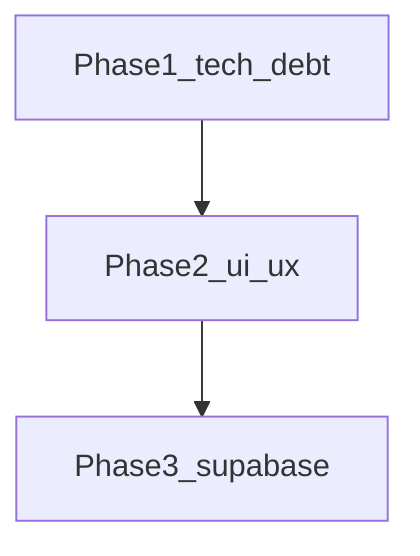

# myScrap roadmap

Personal capture box: paste or drop once, see type tags and a preview, find it again in a recency list. This file lists what ships today, what comes next, and in what order.

Related: [README.md](README.md) · [PRODUCT.md](PRODUCT.md) · [DESIGN.md](DESIGN.md)

**Order of work:** Phase 1 (tech debt) → Phase 2 (UI/UX) → Phase 3 (Supabase). Do not start Phase 3 until 1 and 2 are done. Phase 1 and 2 stay static HTML / CSS / JS with no build step.

---

## Shipped

Client-only. No accounts, no sync, no real OAuth.

### Capture and classify

- [x] Demo entry: Apple ID, Google, or Browse. Session flag in `localStorage` only. Nothing talks to Apple or Google.
- [x] Composer: paste text or a URL, Enter to stick, drag-and-drop on the input.
- [x] `+` menu: clipboard, photo pick, file attach. Camera only on coarse pointers or viewports under 721px.
- [x] Classify-then-save draft: detected type, editable label, add/remove tags, memo, preview, save or cancel.
- [x] Multi-file queue while a draft is open.
- [x] Sample scraps labeled Sample / 견본. Toggle to show or clear them.

### Type previews

- [x] Link: Open Graph via microlink, then corsproxy / allorigins. Fallback is hostname and path.
- [x] Image: show the image. Compress long edge to 1600px before persist.
- [x] Video: poster frame; hover or tap to play. Honors `prefers-reduced-motion` for hover-play.
- [x] Audio: disc art; hover or tap to play.
- [x] Document: PDF first page via pdf.js (best over `http://localhost`). txt / md / csv excerpt. Office and HWP: extension tag and filename slip, not a page render.

### List and chrome

- [x] Recency list, newest first. Peel (delete) one item. Empty the door with a two-step confirm.
- [x] KO / EN in one layout. Light / dark. Follows the system until the user picks one. Both remembered on this device.
- [x] Empty state ("항목이 없습니다." / English equivalent). Scroll-to-top FAB when not at the top.
- [x] Skip link, visible focus, `prefers-reduced-motion`.
- [x] Persist scraps in `localStorage` (~4.2MB budget). Large files may stay session-only. Over quota, media data URLs are stripped.

---

## Not shipped

Grouped by when they will be built. Checkboxes below are the work queue.

### Intentionally out of Phase 1 and 2

- Team / workspace language, Notion-style sidebar, folder tree.
- Live camera viewfinder (file `capture` input is enough).
- Server-side or paid AI tagging.
- Share, export, account settings screens.
- Bundler, test runner, or framework. Stay static HTML / CSS / JS through Phase 2.
- IndexedDB as a new client database. Frontend-external storage is Phase 3 Supabase.

---

## Phase 1 — Tech debt

Fix confirmed bugs and risk in the current client. No new product surface except wiring the Stick disabled state that CSS already describes. No IndexedDB. No auth provider.

Storage stays [`js/storage.js`](js/storage.js) + `localStorage`. Document the key contract (below) so Phase 3 can swap the implementation behind `MyScrapStorage`.

- [ ] **Unknown file type.** [`js/tagger.js`](js/tagger.js) `typeFromMime` ends in `ext ? "document" : "document"`. Unknown binaries always become documents. Use a distinct type or `document` plus an `unknown` tag so office-like files and mystery blobs are not the same.
- [ ] **XSS surface.** [`js/app.js`](js/app.js) `el()` accepts unused `html` and writes `innerHTML`. Remove that path. Keep `text` only.
- [ ] **Hover-play always on.** `bindHoverMedia` uses `wrap.matches(":hover") || true`, so the hover check never matters. Drop the tautology. Keep reduced-motion skip and click-to-toggle.
- [ ] **Error copy.** File ingest `catch` always shows `errorQuota`. Split read/preview failure from quota failure.
- [ ] **`storedMedia` consistency.** When quota stripping sets `storedMedia: false` or deletes `dataUrl`, the in-memory scrap and the persisted copy must match. Do not leave a data URL in memory that will vanish on reload, or a list item that still points at a stripped URL. Empty-media UI is Phase 2.
- [ ] **Clipboard double ingest.** The clipboard loop can ingest both an image and `text/plain` from the same item. Prefer file/image; only ingest text when no file was used.
- [ ] **Stick disabled.** [`.send-btn:disabled`](css/styles.css) exists but the button never disables. Disable when the composer is empty; empty submit is a no-op.
- [ ] **Storage adapter boundary.** Keep `MyScrapStorage` as the only persist API (`getLang` / `setLang` / `getTheme` / `setTheme` / session / `loadScraps` / `saveScraps`). Do not leak `localStorage` keys into [`js/app.js`](js/app.js). Phase 3 replaces the implementation, not the call sites.

### Storage key contract (Phase 3 swap point)

| Key | Value |
| --- | --- |
| `myscrap.lang` | `"ko"` \| `"en"` |
| `myscrap.theme` | `"light"` \| `"dark"` (missing = follow system) |
| `myscrap.session` | `{ method, enteredAt }` demo session |
| `myscrap.scraps` | JSON array of scrap objects |

Scrap shape used today (fields may be empty): `id`, `createdAt`, `type`, `tags`, `title`, `text`, `url`, `filename`, `mime`, `extension`, `size`, `dataUrl`, `posterUrl`, `previewText`, `pages`, `og`, `ogStatus`, `analyzing`, `sample`, `ephemeral`, `storedMedia`, `domain`, `error`, `memo`.

Quota: persist budget about 4.2MB string length. `ephemeral` scraps drop `dataUrl` on save. If still over budget, strip long `dataUrl`s, then drop `dataUrl` / `posterUrl` / `og` and set `storedMedia: false`.

---

## Phase 2 — UI/UX

Fill gaps already implied by [PRODUCT.md](PRODUCT.md) principles and [DESIGN.md](DESIGN.md) states. No folders, no team chrome, no AI.

### Spec gaps

- [ ] **Missing-media slip.** If `storedMedia` is false or `dataUrl` is gone, show filename, extension, and size. Never a broken `` or empty video. Copy should say the file stayed on this device only for the session, or was dropped to free space.
- [ ] **Unsaved draft.** Leaving the app or emptying the door while a draft is open must confirm. Cancel keeps the draft.
- [ ] **Theme: return to system.** After the user picks light or dark, they cannot follow the system again. Add a system option or a clear control. Default remains system until the first explicit pick.
- [ ] **Edit a saved scrap.** Peel is not enough. Re-open type, tags, and memo (same draft fields) without forcing a delete-and-restick.
- [ ] **Composer auto-grow.** `#composer-input` is `rows="1"` and does not grow with pasted text. Grow with content; cap at a few lines, then scroll.

Stick disabled is listed in Phase 1 (behavior). Visual disabled state already exists in CSS.

### Findability (principle 3: recency until the user asks)

- [ ] **Type filter chips.** note / photo / video / audio / link / document. One type at a time or all. Newest-first inside the filter. No sidebar.
- [ ] **Filter by tag.** Clicking a tag on a clipping filters the list to that tag. Clear control to return to the full recency list.
- [ ] **Light search.** One field above the list: title, body, filename, URL, tags. No search page, no filters drawer.

### Preview quality

- [ ] **Image lightbox.** Tap a photo clipping to enlarge. Close on backdrop, Escape, or a peel-adjacent close control. Honor reduced motion.
- [ ] **Copy link / save file.** Link clippings: copy URL. File clippings: open or download the original data URL when `storedMedia` is true.
- [ ] **Peel confirm.** Individual delete gets a short confirm, same voice as empty-the-door (`떼어내기` / Peel off), not a generic browser `confirm()` if a two-step control fits.

### Out of Phase 2

Live camera viewfinder, AI tagging, share/export, account settings.

---

## Phase 3 — Supabase (last)

Frontend-external auth, database, and file storage. Design only until Phase 1 and 2 are done. Replace the `MyScrapStorage` implementation; keep classify-then-save and the fridge-door UI.

- [ ] **Auth.** Real Apple / Google. Browse becomes anonymous or device-only with a clear remaining local path. Demo `myscrap.session` goes away.
- [ ] **Database.** `scraps` table matching the scrap contract above (no giant data URLs in a row). Recency index. RLS so a user reads and writes only their scraps.
- [ ] **Storage.** Images, video, audio, documents in Supabase Storage. List and draft previews use public or signed URLs, not `localStorage` data URLs.
- [ ] **Sync.** Same account, more than one device. Conflict rule: last write wins unless a simpler append-only model is enough.
- [ ] **Open Graph.** Move off public proxies (microlink / corsproxy / allorigins) to an Edge Function or server fetch. Client keeps hostname/path fallback.
- [ ] **Migration.** One-time copy from `myscrap.scraps` into the signed-in account, then stop writing media blobs to `localStorage`.

Server-side AI tagging stays optional and is not required to close Phase 3.

---

## Suggested sequence inside a phase

Phase 1: `typeFromMime` → `el()` innerHTML → hover-play → clipboard ingest → error copy → `storedMedia` persist → Stick disabled → confirm `MyScrapStorage` is the only persist API.

Phase 2: missing-media slip → Stick/draft safety (unsaved warning, auto-grow) → theme system reset → edit saved scrap → type chips → tag filter → search → lightbox → copy/save → peel confirm.

Phase 3: storage adapter behind `MyScrapStorage` → Auth → tables + RLS → Storage buckets → OG function → localStorage migration.
