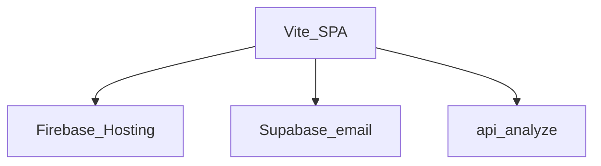

# Mybrary roadmap

Personal capture box: paste or drop once, see type tags and a preview, find it again in a recency list. This file lists what ships today, what comes next, and in what order.

Related: [README.md](README.md) · [PRODUCT.md](PRODUCT.md) · [DESIGN.md](DESIGN.md) · [ARCHITECTURE.md](ARCHITECTURE.md)

**Shipped:** Vite + React SPA on Firebase Hosting (`mybrary-snuu09`). Email Auth, `public.scraps`, Claude classify via `/api/analyze`.

**Next:** Fill Vite env vars, rebuild Hosting, add the Firebase origin to Supabase Auth redirect URLs. Blaze + `functions/.env` if Claude should run on Firebase. Binding product and visual rules: [PRODUCT.md](PRODUCT.md) and [DESIGN.md](DESIGN.md).

The app is a Vite + React (TypeScript) SPA. API keys are not in the repo. Copy [.env.example](.env.example). Language, theme, and palette stay on this device. Scraps require a signed-in Supabase user.

---

## Current SPA

With empty Vite env vars the intro stays public. With a real URL and anon key, email sign in writes scraps per user. Live: [https://mybrary-snuu09.web.app](https://mybrary-snuu09.web.app).

### Capture and classify

- [x] Entry: email sign up / sign in in the header sheet. No Apple, Google, 둘러보기, or `localStorage` scrap store.
- [x] Composer: paste text or a URL, drag-and-drop, `+` (clipboard, camera on phones, photo, file).
- [x] Classify-then-save draft: type, tags, memo, skeleton while `/api/analyze` (or MIME fallback) runs. A new Stick replaces an open draft.
- [x] Recency list, newest first. Type chips and search. Peel from the row.
- [x] KO / EN, 기본 / 현무암, light / system / dark on this device.
- [x] Intro full-bleed still, legal routes `/terms` `/privacy`, operator 표시 예정.
- [x] Firebase Hosting `dist` + SPA rewrite. Cloud Function source for `/api/analyze` (needs Blaze to go live).

### Not in this SPA (later)

일자별 calendar, celadon AI palette, Apple/Google OAuth, sample-scrap toggle, phishing meter, lightbox, Empty-the-door, edit-saved-scrap, OG/pdf.js previews from the old static client.

---

## Intentionally out of this product

- Team / workspace language, Notion-style sidebar, folder tree.
- Live camera viewfinder (file `capture` input is enough).
- Share, export, account settings screens beyond 나가기.
- IndexedDB as a client database. Persist scraps in Supabase.
- A second static `js/` / `css/` client.

### Operator follow-up (not code)

Create a Supabase project and paste the URL plus anon key into `.env` as `VITE_SUPABASE_URL` and `VITE_SUPABASE_ANON_KEY`. Rebuild before Hosting deploy. See [`supabase/README.md`](supabase/README.md).

---

## Phases 1–4 (historical)

The checklists below describe the **old static HTML/JS client**. They stay as a record of what that tree shipped. Do not re-open `js/config.js` or `legal/*.html`. Current files: [ARCHITECTURE.md](ARCHITECTURE.md).

---

## Phase 1 — Tech debt

Fix confirmed bugs and risk in the current client. No new product surface except wiring the Stick disabled state that CSS already describes. No IndexedDB. No auth provider.

Storage stays [`js/storage.js`](js/storage.js) + `localStorage`. Document the key contract (below) so Phase 3 can swap the implementation behind `MybraryStorage`.

- [x] **Unknown file type.** [`js/tagger.js`](js/tagger.js) `typeFromMime` ends in `ext ? "document" : "document"`. Unknown binaries always become documents. Use a distinct type or `document` plus an `unknown` tag so office-like files and mystery blobs are not the same.
- [x] **XSS surface.** [`js/app.js`](js/app.js) `el()` accepts unused `html` and writes `innerHTML`. Remove that path. Keep `text` only.
- [x] **Hover-play always on.** `bindHoverMedia` uses `wrap.matches(":hover") || true`, so the hover check never matters. Drop the tautology. Keep reduced-motion skip and click-to-toggle.
- [x] **Error copy.** File ingest `catch` always shows `errorQuota`. Split read/preview failure from quota failure.
- [x] **`storedMedia` consistency.** When quota stripping sets `storedMedia: false` or deletes `dataUrl`, the in-memory scrap and the persisted copy must match. Do not leave a data URL in memory that will vanish on reload, or a list item that still points at a stripped URL. Empty-media UI is Phase 2.
- [x] **Clipboard double ingest.** The clipboard loop can ingest both an image and `text/plain` from the same item. Prefer file/image; only ingest text when no file was used.
- [x] **Stick disabled.** [`.send-btn:disabled`](css/styles.css) exists but the button never disables. Disable when the composer is empty; empty submit is a no-op.
- [x] **Storage adapter boundary.** Keep `MybraryStorage` as the only persist API (`getLang` / `setLang` / `getTheme` / `setTheme` / `getPalette` / `setPalette` / session / `loadScraps` / `saveScraps`). Do not leak `localStorage` keys into [`js/app.js`](js/app.js). Phase 3 replaces the implementation, not the call sites.

### Storage key contract

Language, theme, and color palette always stay on this device. Session and scraps stay in `localStorage` until [`js/config.js`](js/config.js) has a real URL and anon key **and** the user is signed in. Then `MybraryBackend` owns scraps; demo `mybrary.session` is ignored.

| Key | Value |
| --- | --- |
| `mybrary.lang` | `"ko"` \| `"en"` |
| `mybrary.theme` | `"light"` \| `"dark"` (missing = follow system) |
| `mybrary.palette` | `"basalt"` (missing = kitchen / default) |
| `mybrary.session` | `{ method, enteredAt }` demo session (local path only) |
| `mybrary.scraps` | JSON array of scrap objects (local path; one-time migrate when remote is empty) |
| `mybrary.migratedUser` | last Supabase user id that already received the local copy |

If a `mybrary.*` key is empty, the client copies the matching leftover `myscrap.*` value once.

Scrap shape (fields may be empty): `id`, `createdAt`, `updatedAt`, `type`, `tags`, `title`, `text`, `url`, `filename`, `mime`, `extension`, `size`, `dataUrl`, `posterUrl`, `previewText`, `pages`, `og`, `ogStatus`, `analyzing`, `sample`, `ephemeral`, `storedMedia`, `domain`, `error`, `memo`, `mediaPath`, `posterPath`.

Quota (local path): persist budget about 4.2MB string length. `ephemeral` scraps drop `dataUrl` on save. If still over budget, strip long `dataUrl`s, then drop `dataUrl` / `posterUrl` / `og` and set `storedMedia: false`. Remote path stores media in the private `scrap-media` bucket and rows in `public.scraps` (body column maps to `text`).

---

## Phase 2 — UI/UX

Fill gaps already implied by [PRODUCT.md](PRODUCT.md) principles and [DESIGN.md](DESIGN.md) states. No folders, no team chrome, no AI.

### Spec gaps

- [x] **Missing-media slip.** If `storedMedia` is false or `dataUrl` is gone, show filename, extension, and size. Never a broken `` or empty video. Copy should say the file stayed on this device only for the session, or was dropped to free space.
- [x] **Unsaved draft.** Leaving the app or emptying the door while a draft is open must confirm. Cancel keeps the draft.
- [x] **Theme: return to system.** After the user picks light or dark, they cannot follow the system again. Add a system option or a clear control. Default remains system until the first explicit pick.
- [x] **Edit a saved scrap.** Peel is not enough. Re-open type, tags, and memo (same draft fields) without forcing a delete-and-restick.
- [x] **Composer auto-grow.** `#composer-input` is `rows="1"` and does not grow with pasted text. Grow with content; cap at a few lines, then scroll.

Stick disabled is listed in Phase 1 (behavior). Visual disabled state already exists in CSS.

### Findability (principle 3: recency until the user asks)

- [x] **Type filter chips.** note / photo / video / audio / link / document. One type at a time or all. Newest-first inside the filter. No sidebar.
- [x] **Filter by tag.** Clicking a tag on a clipping filters the list to that tag. Clear control to return to the full recency list.
- [x] **Light search.** One field above the list: title, body, filename, URL, tags. No search page, no filters drawer.

### Preview quality

- [x] **Image lightbox.** Tap a photo clipping to enlarge. Close on backdrop, Escape, or a peel-adjacent close control. Honor reduced motion.
- [x] **Copy link / save file.** Link clippings: copy URL. File clippings: open or download the original data URL when `storedMedia` is true.
- [x] **Peel confirm.** Individual delete gets a short confirm, same voice as empty-the-door (`떼어내기` / Peel off), not a generic browser `confirm()` if a two-step control fits.

### Out of Phase 2

Live camera viewfinder, AI tagging, share/export, account settings.

---

## Phase 3 — Supabase (last)

Frontend-external auth, database, and file storage. Implemented in the client behind `MybraryStorage` / `MybraryBackend`. Keep classify-then-save and the fridge-door UI. **Do not commit real keys.** Paste them later into [`js/config.js`](js/config.js) (see [`js/config.example.js`](js/config.example.js) and [`supabase/README.md`](supabase/README.md)). Placeholder `YOUR_*` values and empty strings keep the local demo path.

- [x] **Auth.** When configured: Apple / Google via `signInWithOAuth`. Browse via `signInAnonymously`. When not configured: demo `mybrary.session` on this device, unchanged.
- [x] **Database.** `public.scraps` matching the scrap contract (no giant data URLs in a row). Recency index. RLS so a user reads and writes only their scraps.
- [x] **Storage.** Images, video, audio, documents in private bucket `scrap-media` under `{userId}/{scrapId}/`. List and draft previews use signed URLs after upload.
- [x] **Sync.** Same account, more than one device. Last write wins (upsert by scrap `id`). Realtime plus reload when the tab becomes visible. Language and theme stay local.
- [x] **Open Graph.** Prefer Edge Function `og-preview` (JWT) when signed in. Fall back to microlink / corsproxy / allorigins, then hostname/path.
- [x] **Migration.** One-time copy from `mybrary.scraps` into the signed-in account if the remote list is empty, then stop writing media blobs to `localStorage` for that user.

Operator work (not in this repo): create the Supabase project, enable providers, run the SQL, deploy the function, paste URL + anon key. Never put `service_role` in the browser.

Server-side AI tagging stays optional and is not required to close Phase 3.

---

## Phase 4 — Intro, calendar filter, Korean footer

Public first screen, header auth, date findability, and the legal chrome a Korean web service needs. Historical: this phase shipped on the static client. The SPA kept intro, header email, and footer; it did not keep 일자별. Binding visuals: [DESIGN.md](DESIGN.md) Phase 4 rules. Do not add a Notion sidebar, a calendar product, or a purple SaaS landing.

### Sequence inside Phase 4

1. Intro page + header login (entry).
2. Korean legal footer on intro and app (the intro is public).
3. 일자별 calendar filter in list tools.

### Main screen: intro instead of login

`#view-login` is gone. The first page is the **intro**. Login does not own the first viewport.

- [x] **`data-surface`:** `"intro"` | `"app"`. Drop `"login"` as a full-page surface. First visit with no session paints intro. A saved session still skips intro and opens the door (`app`), same as today.
- [x] **First viewport:** Hero plus a short product line, then interactive scenes that show the job: paste/drop, classify-then-save, recency list. Visualize those three jobs with fridge-door materials (composer, tags, magnet snap), not generic SaaS bento cards or a phone mock full of fake metrics.
- [x] **Trend, still this product.** Large type, generous space, sticky compact header, pointer or scroll reveals. Stay on SUIT, peach kitchen / night kitchen, and one magnet accent. Not Inter, not Linear/Stripe purple, not a looping Lottie, not page-wide parallax, not confetti. Honor `prefers-reduced-motion` (static frames, no autoplay motion).
- [x] **Primary CTA** on the intro starts capture: opens the header auth menu, or Browse if that is the one-tap path. Copy stays personal (문을 연다 / 붙인다). Do not invent customers, download counts, or AI claims. Sample scraps in the app list are labeled 견본 / Sample.
- [x] **Motion.** Intro → app reuses the existing door-open handoff. Returning session still instant. Quiet Door and One Job still apply.

### Login moves to the header

- [x] **Header 로그인.** Apple / Google / Browse leave the main column. They live in the header on intro (and remain available on app until a session exists, if needed). Compact control: 로그인 / Sign in opens a paper sheet or menu anchored to the header, 32px radius, 48px auth rows, 18px marks. Light sheet is white (the old doorstep, now in the header). Dark sheet is night enamel. Language, palette, and theme stay in the settings sheet. Header is brand + 로그인 + settings.
- [x] **Browse** stays the no-account path. Empty config: demo `mybrary.session`. Filled config: OAuth / anonymous, unchanged.
- [x] **After session:** session chip + 나가기 in the settings sheet. Intro is not shown again until they leave. Leave with a draft still two-step confirms, then returns to intro (not to a full-page login).
- [x] **KO/EN, palette, theme** stay in the settings sheet on intro and app.

### Calendar-based scrap management

Findability stays on the recency list. This is a **date filter**, not a calendar app and not a second home.

- [x] **일자별 control** in `#list-tools`, with the type chips (not a new page, not a sidebar, not a filters drawer). Label: 일자별 / By day.
- [x] **Month calendar** in the list-tools area. Local calendar dates from `createdAt`. Each day that has scraps shows the **count** stuck that day. Empty days stay muted with no number. Today is marked without looking like a selected filter.
- [x] **Click a day** to filter the list to scraps created that local day. One selected day at a time. Selected day uses the magnet. Click again or 조건 지우기 clears the date filter.
- [x] **Combine** with type chips, tag filter, and search (AND). Inside a day, order is still newest first.
- [x] **Month prev/next.** Keyboard: arrows between days when the calendar is open, Escape closes or clears according to existing menu patterns.
- [x] **View-only.** Do not persist the selected day in `localStorage`. Counts come from in-memory scraps (local or already-loaded remote). Do not add a backend date index in this phase.
- [x] **Empty.** No scraps that day uses the existing filter-empty copy plus 조건 지우기.

### Korean web-service footer

The current footer is a one-line product note plus 비우기. Public Korean web services need identity and policy links on every page, including intro.

- [x] **Always on intro and app:** service name, operator identity, contact, policy links, copyright. 비우기 stays app-only, in the footer tools, two-step as today.
- [x] **Policy links:** 이용약관, **개인정보처리방침** (visually distinct: bolder or magnet, so it is easy to find). Optional 고객센터 / 문의 if it points at the same contact email. Static pages: [`legal/terms.html`](legal/terms.html) and [`legal/privacy.html`](legal/privacy.html) (no build step, same header/footer chrome). KO and EN.
- [x] **Identity block** (footer, small caption type). Placeholders until real operator data exists. Do **not** invent a 사업자등록번호 or 통신판매업 신고번호.

| Field | Notes |
| --- | --- |
| 서비스명 | MyBrary |
| 운영 주체 / 대표자 | Placeholder until filled |
| 주소 | Placeholder; include a complaints address when real |
| 전화 | Placeholder |
| 이메일 | Placeholder (문의) |
| 사업자등록번호 | Omit or "해당 시 표시" until a real number exists |
| 통신판매업 신고번호 | Omit until the service sells. This product is not a mall yet. |
| 호스팅 제공자 | Placeholder (e.g. the host you actually use) |
| 저작권 | © year MyBrary |

- [x] **Config, not git secrets.** Put operator strings in one obvious place ([`js/config.js`](js/config.js) or a small `js/legal.js` i18n table) so they can be filled later. Empty placeholders must look like placeholders, not fake registrations.
- [x] **Privacy page** must describe what this client actually stores today (this-device `localStorage` vs Supabase account after keys). Do not claim a data-protection officer or EU DPO that does not exist.
- [x] Footer stays readable on peach and night kitchen (Cave Check, ≥4.5:1). Do not turn it into a four-column marketing sitemap.

### Out of Phase 4

Folder tree, share/export, account settings beyond 나가기, cookie consent banners (no trackers ship today), a standalone calendar product, paid plans, or rewriting into a framework.

---

## Suggested sequence now

1. Fill `.env`, `npm run deploy:hosting`, add Firebase origins to Supabase Auth.
2. Blaze + `functions/.env` if `/api/analyze` should call Claude on Hosting.
3. Later product (optional): 일자별, edit saved scrap, richer previews. Do not revive `js/` or `css/`.

Phases 1–4 below are the static-client history, not the next build order.
